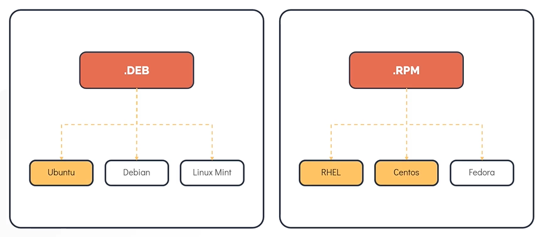

# Linux Desktop Environment
- Let's say we decide to go with Ubuntu which is having a large user community and also a good lifecycle support, but there are 8 official versions that look and behave differently inside of Ubuntu. To consider Linux Desktop Environment we have to consider some of the below factors:

## Kernel
- A fundamental part of OS that is responsible for managing hardware and system resources.
- To communicate with this Kernel to perform some operations we need to run commands using terminal or command line.

## Command Syntax
- Command syntax are the rules in which commands need to be run.

## Desktop Enivornment
- It is the GUI (Graphical User Interface)
- Windows or Mac are having inseparable desktop inside of their system. But in a Linux Desktop, we can change them out as they are modular. 

## Examples
- Ubuntu – Unity, Kubuntu, Xubuntu

---

# Linux Shell and Commands 
- The Linux Shell is a program that allows text-based interaction between the user and the OS. 
- It is a Command-Line Interface (CLI) that acts as an interpreter between the user and the OS.
- This interaction is carried out by typing commands into the interface and receiving response in the same way.

## Examples of Shell
- Bourne Again Shell (bash)
- Bourne Shell (sh)
- C Shell (csh or tcsh)
- Korn Shell (ksh)
- Z Shell (zsh)

## Terminal 
- It is a program that provides access to a shell session.
- Examples:
    - gnome-terminal
    - konsole
    - xterm
    - rxvt
    - kvt
    - nxterm
    - eterm

## Managing Software Packages
### Package
- A package is a compressed achieve that contains all the files that are required by a particular software to run.

### Package Manager
- A package manager is a software in a Linux system that provides the consistent and automated process in installing, upgrading, configuring and removing packages from the operating system.

### Common type of packages
- **.deb**: 
    - Debian, Debian-derived distros
    - Package managers: DPKG, APT-GET, and APT
- **.rpm**:
    - Red Hat, Fedora, openSUSE
    - Package managers: RPM, YUM, and DNF
- **.tgz**:
    - The universal Linux format

