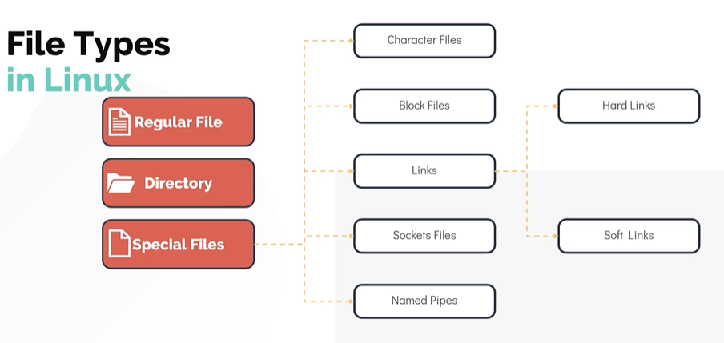

# Introduction to the Linux Filesystem
- Linux is a multiuser system, any number of users can simultaneously work on one single machine.

## Types of users
- Normal user
- Superuser/administrator (root): Can access all parts of the system

## Home Directory 
- When you log into the shell, the very first directory you are taken to is the **home directory**.
- The home directory in Linux is a personal space on the file system which allows users to store their personal data in the form of files and directories.
- Each user in the system gets their own unique home directory with complete access to it, to be able to save, retrieve and delete data.
- The home directory is typically located under the <code>/home</code> directory (<code>/home</code> us system create directory). For example:
    - If your username is rohit, your home directory will be <code>/home/rohit</code>.
    - System administrators (root users) usually have their home directory as <code>/root</code>.
- There is a environment variable called <code>$HOME</code> which holds the value of home directory of the user.
```bash
echo $HOME
```
- The <code>~</code> (tilde)symbol is shorthand for the home directory, so you can reference it like this:
```bash 
ls ~
```

## System Directory
- Holds central configuration and executable files that can only be modified by the superuser.

## File Types in Linux
- There are three types of files.
    1. **Regular File**: Most common type of files that contains text, data, images, etc.
    2. **Directory**: Is a type of file that stores other files and directories within.
    3. **Special Files**: Are categorized into five other file types:
        1. Character Files:
            - These files represent devices under the /dev file system that allows OS to communicate to IO devices serially.
            - Examples: keyboard, mouse, etc.
        2. Block Files:
            - These files represent block devices also located under /dev/ file system.
            - Examples: hard disks, RAM, etc.
        3. Links: 
            - Links in linux is a way to associate two or more file names to the same set of file data.
            - There are two types of links:
                1. The Hard Link:
                    - It associates two or more file names that share the same block of data on the physical disk.
                    - Although they behave as an independent files, deleting one link will delete the data.
                2. The Soft Link:
                    - Also known as symbolic link or symlink (can be compared to the shortcut we create in Windwos).
                    - Deleting a symlink does not affect the data in the actual file.
        4. Sockets:
            - A sockets is a special file that enables the communication between two processes.
        5. Named Pipes:
            - The Named Pipes is a special type of file that allows connecting one process as an input to another.
            - The data flow in a pipe is unidirectional from the first process to the second.



---

# Linux Filesystem Key Features
- In Linux, data from unmounted partition or device is inaccessible.
- Linux distinguishes between uppercase and lowercase letters in the filesystem.
    - Example: test.txt . TeST.txt . Test.txt
- Files in Linux may have a file extension, but do not need to have one.
- Files can be hidden by adding a dot ( . ) at the beginning of the filename.
- Only the owner of a file or directory (plus the root user) can grant access.
- Access permissions:
    - Read
    - Write
    - Execute
- Access permissions to files and folders can be changed through the shell or the file manager.
- Filesystem Hierarchy Standard (FHS):
    - Distinguishes between shareable and unshareable files, and between static and variable files
    - Shareable files – user data files, program binary files
    - Unshareable files – configuration files
    - Static files – program executables
    - Variable files – any files stored in the home directory like documents, photos

---

# File references
- Absolute
    - Relative to the root directory
    - Begins with a forward slash
    - Example: /home/user1/file.txt
- Home Directory
    - A tilde (~) replaces the path’s home directory
    - Example: ~/file.txt
- Relative
    - Relative to the current directory
    - Subdirectories
        - <code>.</code> refers to “this” directory
        - <code>..</code> refers to the parent directory
    - Subdirectory replaces the parent directory
    - Example: ../dir2/afile.txt

---

# File Creation and Management
- Touch (touch)
    - Creates files on the command line
    - Example: touch newfile.txt
    - Empty files can act as “scratch files”
- Copy (cp)
    - Copies files
- Move (mv)
    - Moves and renames files
    - The mv command’s effects are much like cp, except the new file will replace the original file
    - Copies and deletes the original file

---

# Creating Links
## Hard Link
- A duplicate directory entry where both entries point to the same file
```bash
ln <original-filename> <linkname>
```

## Symbolic Link
- A file that refers to another file by name
```bash
ln -s <original-filename> <linkname>
```

---

# Wildcards and Case Sensitivity
- In Linux, wildcards, also known as **globbing patterns**, are special characters or symbols used in the command line to match and select multiple files or directories based on a pattern.
- Wildcards act as stand-in for other characters.

## Types of Wildcards
1. Question mark ( ? )
- Matches exactly one or single character.
- Example: 
    - b??l can match bowl, ball, bull, etc.
    - file?.txt would match file1.txt, file2.txt, etc.

2. Asterisk ( * )
- Matches zero or more characters.
- Example: 
    - b*l can match bowl, ball, bull, bl, bbll, brawl, etc.
    - *.txt would match all files ending with .txt.

3. Bracketed value ( [ ] )
- Matches any character inside the bracket.
- Matches a range or set of characters.
- Example: 
    - b[ao][lw]l can match bowl, ball, etc., but not bull.
    - file[1-5].txt would match file1.txt, file2.txt, etc., and file[abc].txt would match filea.txt, fileb.txt, and filec.txt.

4. Exclamation mark (!):
- Used within square brackets to negate a pattern, meaning it will match characters that are not in the specified set.
    
## Case Sensitivity
- Case sensitivity is a function of the Linux filesystem and not the Linux operating system itself.

---

# Manipulating Directories
## Make Directory (mkdir)
- Create a new directory
```bash
mkdir newfolder
```

## Remove Directory (rmdir)
- Delete an **empty** directory.
- Directory names are case sensitive.
```bash
rmdir newfolder
```
- To delete the set of nested empty directories, use <code>-p</code> option (no folder/subfolders contains any file).
```bash
rmdir -p newfolder
```
- To delete directories that contain files, use <code>rm</code> command with <code>-r</code> option.
```bash
rm newfolder
```

## Touch (touch)
- When used with a directory, it only updates the date/time stamp.

## Copy (cp)
- Can be used to copy a directory if used with the -r or –a switches.

## Move (mv)
- Can be used to move or rename directories or files

## Link (ln)
- ln –s can create symbolic links to a directory.
- Directories don’t have support for hard link, it only supports symbolic links.
