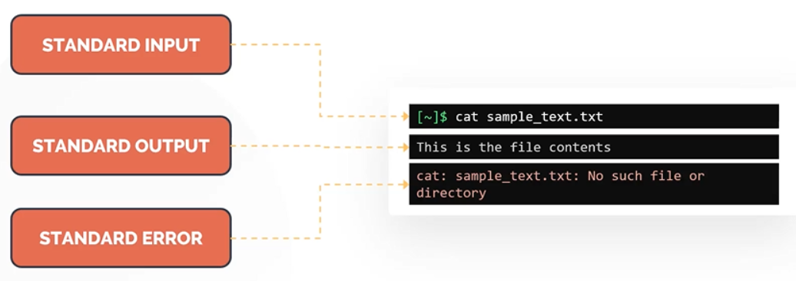

# Command Line Pipes
- Command Line Pipes allow the linking or concatenation of multiple commands.
- In simple terms, pipes allows the first commands standard output to be used as the standard input for the second command.
- The pipes are defined using vertical bar symbol (|).
```bash
grep Hello sample.txt | less
```
- Instead of the redirect operator, we can use the command line pipe (|) followed by <code>tee</code> command.
```bash
echo $SHELL | tee shell.txt
```
- Use tee with -a option, to append instead of overwritting it.
```bash
echo "This is the bash shell" | tee -a
```

--- 

# grep
- To search within files, the most popular command in linux is <code>grep</code>.
- Grep is commonly used to print lines of a file matching a pattern but it also offers a variety of other options.
- The grep command is case-sensitive.
- <code>grep <search-word> <filename></code>: to search for the word second from the sample.txt

---

# IO Redirection
- There are three data streams created when we launch/run a linux command.
    - **Standard Input (STDIN)**: STDIN is the standard input stream which accepts text as an input.
    - **Standard Output (STDOUT)**: Text output is delivered as STDOUT or the standard out stream.
    - **Standard ERROR (STDERR)**: Error messages of the command are sent through the standard ERROR stream.
- With IO Redirection, the STDIN, STDOUT and STDERR can be redirected to a text file.



- Redirect to an output file if you need to save it for future reference.
- Redirect from an input file if you have a program that needs it.
- A program’s output can be used as an input via the process of piping.
- Xargs: Enables a user to generate command line options from files or other programs output.

## Common redirector operations
- Greater than symbol ( **>** )
    - Creates a new file containing standard output
- 2 Greater than symbols ( **>>** )
    - Appends the existing output to an existing file
- The number 2 + Greater than symbol ( **2>** )
    - Creates a new file containing any standard errors
- The number 2 + 2 Greater then symbol ( **2>>** )
    - Appends standard error to an existing file
- Ampersand + Greater then symbol ( **&>** )
    - Creates a new file that contains the standard output and the standard error
- Less than symbol ( **<** )
    - Sends the content of a specified file as input back into the standard input
- 2 Less than symbols ( **<<** )
    - Accepts text on the following lines as standard input
- Less than + Greater than symbols ( **<>** )
    - Specified file can be used for standard input and standard output
- 2> /dev/null: 
    - To execute and not print ERROR messages on the screen even if it generates a standard ERROR. (/dev/null is a bitbucket, where you can dump anything you don’t need)

--- 

# Basic Regular Expressions
- It is a way to describe patterns that a user might want to look for in data files.
- Regular expressions are similar to wildcards.

## Forms of Regular Expressions
1. Basic
2. Extended

## Types of Regular Expressions
1. Alphanumeric/Alphabetic string
2. Non-alphanumeric string

## Special Characters
- **Bracket Expression ([])**: Example: b[aeiou]g can match bag, beg, big, bog, bug
- **Range Expression (-)**: Example: a[2-4]z can match a2z, a3z, a4z
- **Single Character (.)**: Example: a.z can match all words that starts with a and ends in z that has one letter in between
- **Caret (^)**: Shows the start of a line
- **Dollar sign ($)**: Shows the end of a line
- **Repetition (.*)**: Example: .\*
- **Backslash ( \ )**: Used to escape a special character, Example: filename\.txt

---

# Archiving Files 
- <code>tar</code> is used to group multiple files and directories into a single file. Hence it is specially used for archiving data.
- Tar is an abbreviation for **tape archive**.
- Files created with tar are often called **tarballs**.

## Commands
- <code>tar -cf <tarfile-name> <files..></code>: to archive a file or directory.
    - <code>-c</code> to create an archive
    - <code>-f</code> is used to specify the name of the tar file to be created
```bash
tar -cf test.tar file1 file2 file3         # c = create an archive, f = specify the name of tar file
ls -ltr test.tar
```
- <code>tar -tf <tarfile-name></code>: to see the contents of the tarball.
```bash
tar -tf test.tar
```
- <code>tar -xf <tarfile-name></code>: to extract the contents from the tarball.
```bash
tar -xf test.tar
```
- <code>tar -zcf <tarfile-name></code>: to compress the tarball to reduce its size.
```bash
tar -zcf test.tar
```

# Compression 
- Compression is the technique used to reduce the size consumed by a file or a dataset.
- To reduce the size of a file or directory in the linux file system, there are some commands:
    - bzip2 (.bz2 extension)
    - gzip (.gz extension)
    - xz (.xz extension)
```bash
bzip2 test.img
gzip test1.img
xz test2.img
```

## Uncompression
- The compressed files can be uncompressed by using the below commands:
    - bunzip2
    - gunzip
    - unxz
```bash
bunzip2 test.img
gunzip test1.img
unxz test2.img
```

## NOTE
- Compressed files need not to be uncompressed every time.
- Tools such as zcat , bzcat and xzcat allow the compressed files to be read without an uncompress.
```bash
zcat hostfile.txt.bz2
zcat hostfile.txt.gz
zcat hostfile.txt.xz
```
