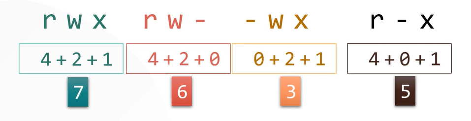

# Understanding Ownership
- <code>ls</code> command can be use to determine the ownership of the file (owner & group).
```bash
ls -l bash-script.sh
-rwxrwxr-x 1 bob bob 89 Mar 17 01:35 bash-script.s
```

## Ownership
- Every file has an associated owner or account with it.
- This also applies to running programs and processes in the system.

## Ownership Association
- UID
- GID

## Change ownership (chown)
- Changes a file’s ownership inside the terminal.
- Can only be done by a **root** user.
```bash
chown owner:group file
```

## Change group (chgrp)
- Changes a file’s group.
- Can also be done by an ordinary user if you’re the file owner and you belong to both groups.
```bash
chgrp group file
```

---

# Understanding Permissions
- Permission defines what file's owner, the member of the file's group, and other users can do with the file (ugo).
- Set of permissions:
    - User (Owner) (u)
    - Group (g)
    - Other (o)

- <code>ls</code> command can be use to determine the permissions of the file (owner, group and others).
```bash
ls -l bash-script.sh
-rwxrwxr-x 1 bob bob 89 Mar 17 01:35 bash-script.s
```
- The output field includes:
    - **Type of file** (first word/character in first column)
    - **Permissions wrt user, group and other** (rest 9 characters in first column (rwx))
    - **Number of links**: Shows the number of unique file names that may be used to access a file
    - **Username**: Identifies the file’s owner
    - **Group name**: Identifies the group that owns a file
    - **File size**
    - **Time stamp**: Tells when a file was last modified
    - **Filename**

- The first letter of the first column in the listing from </code>ls -l</code> command indicated the file type.
| File Type            | Identifier      |
| -------------------- | --------------- |
| Regular/Normal File  | <code>-</code>  |
| Directory            | <code>d</code>  |
| Character Device     | <code>c</code>  |
| Block Device         | <code>b</code>  |
| Link                 | <code>l</code>  |
| Socket File          | <code>s</code>  |
| Named Type File      | <code>p</code>  |

- Other characters such as <code>rwx</code> in the first column describes the file permissions in Linux.
- These characters can be broken down as the **owner permissions**, **group permissions** and **permissions for others**.
- First three characters after the file identifier are the permissions for the owner of the file denoted by the letter <code>u</code>.
- The next three characters are permissions for the group owning the file denoted by <code>g</code>.
- The last three characters are the permissions for all other users, denoted by <code>o</code>.
| Bit            | Purpose  | Octal Value |
| -------------- | -------- | ----------- |
| <code>r</code> | Read     | 4           |
| <code>w</code> | Write    | 2           |
| <code>x</code> | Execute  | 1           |



## Special Cases
- Directory execute bit (x): Grants permission to search the directory.
- Directory write bit (w): Allows a user to create, delete, rename files within a directory, even if the user does not own the file.
- Symbolic link: Permissions on symbolic links are always **777**.
- Root user: Many of the permission rules don’t apply to root.

## User Mask (Umask):
- Determines the default permissions for new files and directories.
- **666** is the default permission attach to new file and **777** is the default permission attach to new directory.

---

# Using Sticky Bits
## Sticky Bit
- A special filesystem flag that alters behaviors and limits a user to only delete own files or files stored in own directory.
- The sticky bit in Linux is a special permission that, when set on a directory, restricts file deletion. Only the file owner, the directory owner, or the root user can remove or rename files within that directory. 

### Octal Code
- 1 – on
- 0 – off
```bash
chmod 1777 /tmp             # 1 denoted sticky bit is on
chmod 0777 /tmp             # 0 denoted sticky bit is off
```

### Symbolic Code
- +t – on
- -t – off
```bash
chmod +t /tmp               # +t denoted sticky bit is on (for all ugo)
chmod ug-t /tmp             # -t denoted sticky bit is off (for ug only and not o)
```

---

# Special Execute Permissions
- **Set User ID (SUID)**: Tells Linux to run the program with the permissions of whoever owns the file rather than the user who runs the program.
- **Set Group ID (SGID)**: Sets the group of the running program to the group of the file.
- **Octal Codes**:
    - 4 to set the SUID bit
    - 2 to set the SGID bit
    - 6 to set both bits
- **Symbolic Codes**:
    - u+s to set the SUID bit
    - g+s to set the SGID bit
    - ug to set both bits

---

# Hiding Files and Directories
- **Hidden bit ( <code>.</code> )**
    - Hides a file in the file manager.
    - Linux uses a file naming convention to hide files by way of a dot ( <code>.</code> ) at the beginning of the file name.
        - Example: <code>.myfile.txt</code>
- **Hidden directories**:
    - Current directory ( <code>.</code> )
    - Parent directory ( <code>..</code> )
- Renaming a file (making it hidden) will also make the file inaccessible to programs that uses it.
- The </code>–d</code> option will get information from the subdirectories rather than the content.
```bash
ls -d mydirectory
```
